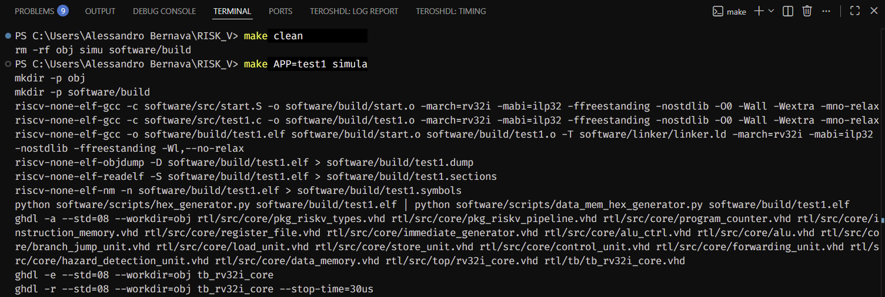
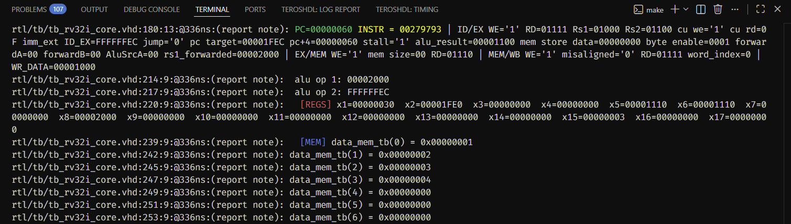

PROGETTO CORE RISC-V RV32I

Questo progetto contiene il design di una CPU RISC-V (RV32I) in VHDL e un flusso di lavoro automatizzato tramite Makefile.
Il Makefile si occupa di compilare il codice C/Assembly, estrarre i dati dall'eseguibile ELF, inizializzare le memorie del processore e avviare la simulazione hardware.

 AMBIENTE DI SVILUPPO E TOOLCHAIN

Il progetto è stato sviluppato e testato su Windows in Visual Studio Code, utlizzato come editor per la scrittura del codice VHDL, programmi in C, script Python e codice assembly.
L'ambiente  è composto da una toolchain software costituita da:
    - un cross compiler GCC
    - un linker script che definisce la mappa di memoria del sistema
    - script Python che elaborano i file ELF generati dalla toolchain e producono le immagini di memoria utilizzate in simulazione per inizializzare instruction e data memory
    - un simulatore VHDL (GHDL) per la verifica ed esecuzione del modello hardware della CPU
    - un Makefile che gestisce l'intero flusso: compilazione del software, linking, esecuzione degli script per la generazione delle memorie, analisi dei moduli hardware, e avvio della simulazione
I comandi Make sono eseguiti da terminale (PowerShell su Windows).

UTILIZZO DEL MAKEFILE

Di default, il Makefile, tramite comando make prenderà il file 'software/src/main.c' per compilarlo e caricarlo sulla CPU.

Comandi principali:

- make (oppure 'make simula')
    Compila main.c, genera l'ELF, crea i file .mem per le memorie, analizza/elabora i file VHDL e simula il testbench.

- 'make APP=nome simula'
    Fa lo stesso di make, ma invece di main.c usa il file nome.c (situato sempre in software/src/). In pratica, 'APP=nome'  permette di scegliere quale programma (presente in src/) far girare sulla CPU senza dover modificare il Makefile.

- 'make onda'
    Come 'simula', ma alla fine genera anche il file .ghw con le forme d'onda da poter ispezionare.

- 'make guarda'
    Apre in automatico GTKWave caricando l'ultima simulazione effettuata.

- 'make clean'
    Pulisce l'ambiente eliminando le cartelle generate (obj/, simu/ e software/build/).

Comandi intermedi (per eseguire solo alcune fasi)
- 'make analizza' : analizza i file VHDL (core, testbench, package)
- 'make elabora'  : costruisce la gerarchia di simulazione per il testbench
- 'make elf'      : compila il programma C in un eseguibile ELF
- 'make dump'     : genera file di testo con il dump dell'assembly e delle sezioni
- 'make mem'      : lancia gli script Python per generare l'hex delle memorie

STRUMENTI NECESSARI

Per far funzionare il tutto, è necessario avere installati i seguenti programmi:

1. GNU Make
2. GHDL (con supporto per VHDL-2008)
3. GTKWave (per visualizzare le forme d'onda)
4. Toolchain GNU RISC-V:
   - riscv-none-elf-gcc
   - riscv-none-elf-objdump
   - riscv-none-elf-readelf
   - riscv-none-elf-nm
   (Nota: strumenti inclusi nella toolchain "xPack GNU RISC-V Embedded GCC")
5. Python 3
6. pyelftools: libreria Python che serve agli script per leggere i file ELF. Installabile con: pip install pyelftools

STRUTTURA DELLA REPOSITORY

Le principali directory del progetto sono:

- rtl/src : contiene il codice VHDL sintetizzabile della CPU (core e top-level)
e i package architetturali.
- rtl/tb/  : include i testbench VHDL (ad es. tb_rv32i_core.vhd per il top-level).
- software/ :
    - software/src/ : programmi C/Assembly (ad es. main.c, test.c, start.S)
    - software/build/ : output della toolchain (ELF, dump, simboli) generato dal Makefile.
    - software/scripts/ : script Python per estrarre le sezioni .text/.data dai file ELF e
             generare i file .mem usati per inizializzare le memorie in simulazione.
- doc/ : documentazione aggiuntiva (attualmente doc/debug_core.txt con i bug rilevati
         durante lo sviluppo) e immagini dimostrative.

ARCHITETTURA DELLA CPU E SCELTE PROGETTUALI

Il processore è stato realizzato secondo la specifica RISC-V RV32I (32-bit), scritto in VHDL e pensato per essere implementato come softcore su FPGA. E' stato implementato con una pipeline a 5 stadi (Fetch, Decode, Execute, Memory, Writeback).

Principali scelte architetturali:

- Memorie sincrone e inferenza delle BRAM: Il core adotta un’architettura Harvard, con Instruction Memory e Data Memory fisicamente separate. Entrambe sono implementate con lettura sincrona. Questa scelta permette agli strumenti di sintesi di mapparle direttamente su blocchi BRAM (Block RAM) delle FPGA, evitando il consumo eccessivo di LUT. Data la latenza di un ciclo delle memorie sincrone, queste assorbono implicitamente le funzioni dei registri di pipeline adiacenti (l'Instruction Memory funge da registro IF/ID; la lettura della Data Memory sostituisce parte del registro MEM/WB).

- Register file a 2 letture / 1 scrittura: il register file (32 registri  x 32 bit) è implementato come array di flip-flop con due porte di lettura asincrone e una porta di scrittura sincrona, quindi viene mappato dagli strumenti di sintesi su logica LUT/FF e non su BRAM (più adatta a memorie grandi). Questo schema è quello classico per il register file di una pipeline RISC: in ID gli operandi rs1/rs2 sono immediatamente disponibili, mentre in WB la scrittura avviene sul fronte di clock.

- Forwarding interno nel register file: Per evitare che una lettura in ID veda un valore vecchio quando nello stesso ciclo lo stadio WB scrive sullo stesso registro, il register file integra un meccanismo di internal forwarding: se we='1' e rd_addr_i coincide con rs1_addr_i o rs2_addr_i, le uscite rs1_data_o/rs2_data_o propagano direttamente write_data_i invece del contenuto di reg. In questo modo il core può leggere il valore appena scritto senza inserire stall tra WB e ID, eliminando lo structural hazard di lettura/scrittura sullo stesso registro nello stesso ciclo.

- Gestione del reset nel register file: Il reset è puramente sincrono, azzera infatti l’intero array di registri solo nel process sincrono (sul fronte di clock) e non interviene nelle uscite combinatorie. Un reset “ibrido” (sincrono sulla memoria, asincrono sulle uscite) comporta il rischio di glitch quando il segnale di reset cambia vicino al fronte del clock su FPGA, rendendo il valore prodotto sulle uscite metastabile. La responsabilità di mantenere we='0' durante il reset è quindi delegata alla Control Unit, e i registri di pipeline (es. ID/EX) vengono azzerati, impedendo la propagazione di eventuali valori spuri. Questa scelta rende il comportamento del register file più deterministico e adatto alla sintesi su FPGA.

- Hazard Unit e Forwarding: Il core implementa un sistema completo di data forwarding (da EX/MEM e MEM/WB verso lo stadio EX) per risolvere gli hazard RAW senza inserire stalli. La Hazard Detection Unit interviene solo per il load-use hazard, congelando PC e Instruction Memory e inserendo una singola bolla (NOP) in ID/EX.

- Gestione dei control hazard e jump tramite Branch Unit: la condizione di salto viene valutata in EX, usando direttamente i due operandi già forwardati e il flag zero della ALU per BEQ/BNE, oppure confronti signed/unsigned per BLT/BGE/BLTU/BGEU, mentre JAL/JALR saltano sempre. Lo schema di branch prediction è 'always not taken' (più semplice schema di static branch prediction): la pipeline continua a fetchare e decodificare normalmente fino a quando la branch arriva in EX; in quel ciclo, se jump_o='1', il core aggiorna il PC al target e inserisce un flush su Instruction Memory e su ID/EX, trasformando in bole NOP le due istruzioni già entrate dopo la branch.
    Il costo del control hazard è quindi di 2 cicli “persi” per ogni branch taken: uno per l’istruzione in IF e uno per quella in ID che vengono annullate quando il salto viene rilevato in EX, mentre le istruzioni già in EX/MEM e MEM/WB proseguono normalmente.

- ALU Control ottimizzato: La Control Unit delega la generazione del codice operativo interno all'ALU Decoder. Sfruttando la codifica nativa dell'ISA RISC-V (es. il bit 30 e il campo funct3 per operazioni logico/aritmetiche R/I), la logica di decodifica dell'ALU risulta estremamente compatta.

- Load/Store Unit separate: Data la natura sincrona della BRAM, la preparazione dei dati da scrivere (con i relativi byte_enable) avviene in MEM (Store Unit), mentre la formattazione dei dati letti (selezione byte/halfword e sign-extension) avviene in WB (Load Unit). Attualmente sono supportati solo accessi di memoria allineati; quelli misallineati generano un segnale di eccezione.

PACKAGE VHDL UTILIZZATI

Per mantenere il design modulare e leggibile, sono stati progettati due package principali:

- Pkg_riskv_types (tipi e costanti ISA):
Raccoglie tutti i tipi e le costanti comuni del progetto:

    - word_t: vettore a 32 bit, unità base per dati e indirizzi.
    - reg_addr_t e reg_file_t: tipo per gli indirizzi dei registri (x0–x31).
    - Tipi e costanti per la memoria (instr_mem_t, data_mem_t, dimensioni, base address dei dati).
    - Costanti per gli opcode (opc_load, opc_op, opc_branch, opc_jal, ecc.) e per i codici ALU (alu_add, alu_sub, alu_sll, …).
    - Costanti funct3 per le varie classi di istruzioni (aritmetiche, branch, load/store) e per i formati (instr_type_t = R, I, S, B, U, J).

In pratica, questo package centralizza la descrizione dell’ISA a livello hardware: tutti i moduli (Control Unit, ALU Control, Branch Unit, LSU) fanno riferimento alle stesse costanti, riducendo errori e duplicazioni.

- pkg_riskv_pipeline (registri di pipeline e reset)
Definisce la struttura dei registri di pipeline:

    - if_id_reg_t: contiene PC, PC+4 e l’istruzione fetchata (instr_if); non utilizzato in quanto sostituito dal modulo Instruction Memory nelle sue funzioni.
    - id_ex_reg_t: contiene indirizzi rs1/rs2/rd, dati (pc, pc4, rs1_data, rs2_data, imm_ext), informazioni di decodifica (f3, f7b, opcode) e tutti i segnali di controllo necessari a EX/MEM/WB (ALUOp, sorgenti A/B, mem_read/write, mem_size/unsigned, reg_write, result_src).
    - ex_mem_reg_t e mem_wb_reg_t: propagano i risultati dell’ALU, l’indirizzo di store/load, i segnali per la memoria e i controlli di writeback.
    - Il package fornisce anche le costanti di reset (ID_EX_REG_RESET, EX_MEM_REG_RESET, MEM_WB_REG_RESET), usate nei process dei registri di pipeline per inserire bolle (NOP) in modo consistente durante reset, flush e stall. Questo approccio evita di ripetere manualmente i campi azzerati in ogni modulo, garantisce che tutti i segnali di controllo siano azzerati in modo uniforme e rende più chiaro cosa contiene ogni stadio della pipeline e come viene resettato.

Questa astrazione permette di gestire il flusso di segnali di controllo attraverso la pipeline, senza far esplodere la complessità. In questo modo il core è più facile da estendere (nuovi segnali di controllo, nuovi tipi di istruzioni) e più leggibile.

MAPPA DI MEMORIA E FLUSSO DI COMPILAZIONE

Il sistema adotta un approccio bare-metal, senza sistema operativo, gestito tramite un linker script personalizzato (linker.ld) e una routine di bootstrap (start.S) scritta in Assembly.

Mappa di Memoria:
Il linker script divide gli indirizzi in due regioni principali:

- ROM (0x00000000 - 0x00000FFF, 4 KiB): Contiene il codice eseguibile (.text) e le costanti a sola lettura (.rodata).

- RAM (0x00001000 - 0x00001FFF, 4 KiB): Contiene le variabili globali inizializzate (.data), quelle non inizializzate (.bss), una zona riservata per eventuale memory-mapped I/O (.out) e lo Stack, che cresce dall'indirizzo più alto (__StackTop) verso il basso. Lo Stack Pointer è allineato a 16 byte come da specifica della ABI RISC-V.

FLUSSO DI BOOTSTRAP E INIZIALIZZAZIONE MEMORIE:

- Compilazione: Il codice C viene compilato assieme al file di bootstrap start.S.

- Bootstrap: Al reset, l'hardware imposta il PC a 0x00000000. Qui risiede, come stabilito dal linker script, la routine di bootstrap (_start) che si occupa di:

    - Inizializzare lo Stack Pointer (sp) alla cima della RAM.
    - Azzerare la sezione .bss.
    - Chiamare la funzione main in C.
    - In caso di uscita dal main, bloccarsi in un loop infinito di halt.

- Immagini di Memoria (Simulazione vs Sintesi): Poiché il codice VHDL parte con memorie vuote, l'ELF generato viene elaborato da script Python che estraggono la sezione .text e la sezione .data. Queste vengono salvate in file formattati che il testbench legge a runtime tramite TEXTIO, pre-caricando così le memorie prima che la simulazione inizi. Questo simula il comportamento che, su FPGA hardware, si otterrebbe pre-inizializzando le BRAM tramite file di configurazione (.coe o .mif) / bitstream.

TESTBENCH E DEBUG
Il testbench fornisce un clock e un segnale di reset iniziale. Oltre a istanziare la CPU, include un monitoraggio approfondito dello stato interno del processore: ad ogni colpo di clock stampa su terminale dati quali i valori del PC, dell'istruzione in corso, i segnali di write-enable nei vari stadi, i dati in scrittura, lo stato di alcuni registri (es. x1-x17) e le prime word della RAM. L'esecuzione si interrompe automaticamente se vengono soddisfatte specifiche condizioni di terminazione o errori architetturali inseriti nei programmi di test. I principali bug rilevati durante lo sviluppo della CPU sono stati descritti in doc/debug_core.txt.

POSSIBILI AREE DI SVILUPPO

A partire dallo stato attuale del progetto ho individuato le seguenti possibili aree di sviluppo:

- Sintesi su FPGA e Memory-Mapped I/O:
  implementazione del core su FPGA (molte scelte di design sono state fatte appunto in vista di questo obiettivo), eventualemente gestione di periferiche (gestite ad esempio tramite protocollo UART).

- Estensione Zicsr e CSR:
  aggiunta delle istruzioni  per la gestione dei CSR, tra cui registri di controllo (cycle, instret, ecc.) per supportare i test ufficiali RISC-V, misurare le performance e gestire eccezioni e interrupt.

- Modalità privilegiate (M-Mode / U-Mode) e PMP:
  introduzione di livelli di privilegio e di protezione  di memoria (Physical Memory Protection - PMP) per isolare regioni RAM/IO da accessi non autorizzati.

- Estensione 'M' (moltiplicazioni/divisioni):
  supporto hardware alle istruzioni di moltiplicazione/divisione RV32IM per eseguire software più complesso senza emulazione software.

- Ottimizzazioni microarchitetturali:
  studio di soluzioni per migliorare le prestazioni della pipeline (ad esempio schemi di branch prediction più avanzati, gestione degli hazard più avanzata,
  ottimizzazione del critical path per aumentare la frequenza di clock).

- Supporto RTOS:
  integrazione di un semplice sistema operativo real-time (timer, interrupt, scheduler)  che sfrutti le modalità privilegiate e i CSR per la gestione dei task.
